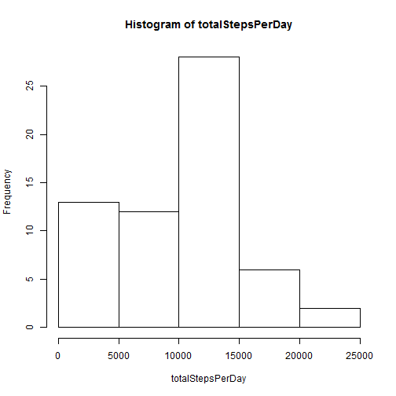
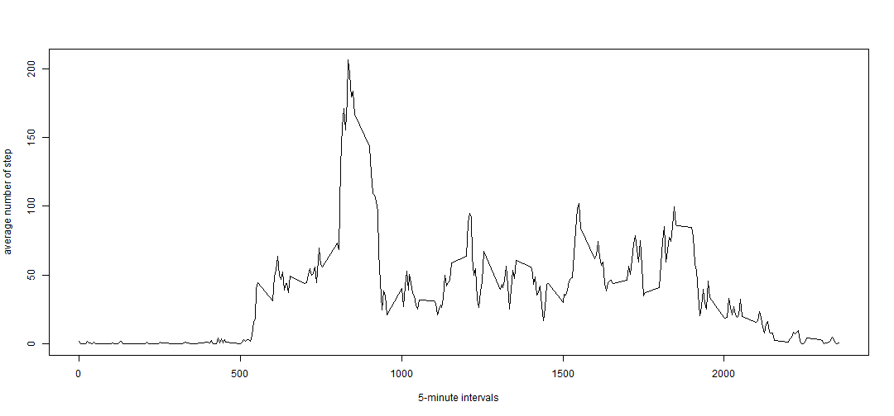
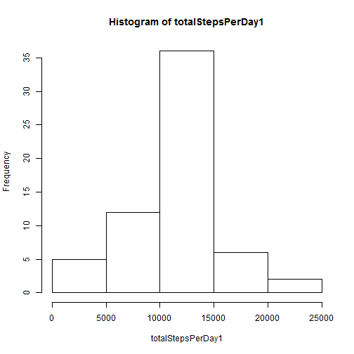
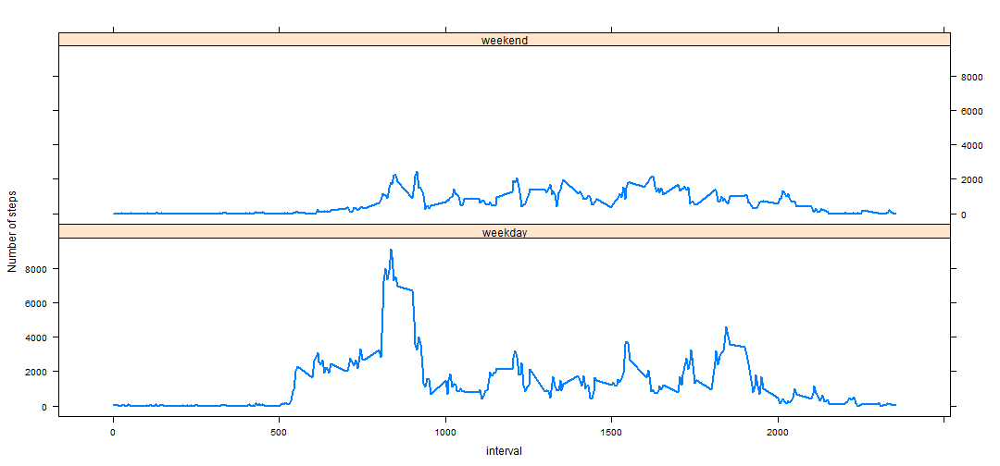

Reproducible Research: Peer Assessment 1
=============================================


## Loading and preprocessing the data


```r
data <- read.csv("./activity.csv", sep = ",", head = T, colClasses = c("integer", 
    "Date", "integer"))
head(data)
```

```
##   steps       date interval
## 1    NA 2012-10-01        0
## 2    NA 2012-10-01        5
## 3    NA 2012-10-01       10
## 4    NA 2012-10-01       15
## 5    NA 2012-10-01       20
## 6    NA 2012-10-01       25
```


## What is mean total number of steps taken per day?

1. Split data by day (date) and calculate steps in each one.
2. Plot the histogamme.
3. Calculate mean and medaine.


```r
totalStepsPerDay <- sapply(split(data$steps, data$date), sum, na.rm = T)

hist(totalStepsPerDay)
```

 

```r

meanPerDay <- mean(totalStepsPerDay)
MedianPerDay <- median(totalStepsPerDay)
```

The mean of number of steps is **9354.2295** and mediane is **10395.**  

## What is the average daily activity pattern?
1. Split data by intervals.
2. Calculate average of steps in each 5 minutes interval.
3. Plot 5-minute interval (x-axis) and the average number of steps taken, averaged across all days (y-axis).
4. Find the interval that contain maximum number of steps. 


```r
avrgPerInterval <- sapply(split(data$steps, data$interval), mean, na.rm = T)
intervals <- unique(data$interval)
plot(x = intervals, y = avrgPerInterval, type = "l", xlab = "5-minute intervals", 
    ylab = "average number of step")
```

 

```r

totPerInterval <- sapply(split(data$steps, data$interval), sum, na.rm = T)
indMax <- which.max(totPerInterval)
intervaleMax <- intervals[indMax]
```


The 5-minute interval, on average across all the days in the dataset, contains the maximum number of steps is **835** and it contain **10927** steps. 
## Imputing missing values

Remove all missing values form data and build new dataSet.

```r
nrow(na.omit(data))
```

```
## [1] 15264
```

```r
NewData <- data
for (i in 1:nrow(data)) {
    if (is.na(data$steps[i])) {
        NewData$steps[i] <- avrgPerInterval[(i%%288) + 1]
    }
}
```


1. Plot the new histogamme.
2. Calculate new mean and medaine after removing missing values.

```r
totalStepsPerDay1 <- sapply(split(NewData$steps, NewData$date), sum, na.rm = T)
hist(totalStepsPerDay1)
```

 

```r

meanPerDay1 <- mean(totalStepsPerDay1)
MedianPerDay1 <- median(totalStepsPerDay1)
```


The new mean of number of steps is **1.0766 &times; 10<sup>4</sup>** and the old one is **9354.2295**.  
The new mediane is **1.0766 &times; 10<sup>4</sup>** and the old one is **10395**.  

## Are there differences in activity patterns between weekdays and weekends?

Function for detrmine using Date if this day is weekend or weekday.

```r
library("reshape")
Sys.setlocale("LC_TIME", "English")
```

```
## [1] "English_United States.1252"
```

```r
weekEndDay <- function(x) {
    if (weekdays(x) %in% c("Saturday", "Sunday")) {
        "Weekend"
    } else {
        "weekday"
    }
}
```


1. Add new column in data idicate if this day is weekend or week day.
2. Make a panel plot containing a time series plot (i.e. type = "l") of the 5-minute interval       (x-axis) and the average number of steps taken, averaged across all weekday days or weekend days (y-axis). 


```r
weekend <- sapply(data$date, weekEndDay)
data <- cbind(data, weekend)
data <- cbind(data, weekend)
splited <- split(data, data$weekend)
d1 <- splited$weekday
d2 <- splited$Weekend
avrgPerInterval1 <- sapply(split(d1$steps, d1$interval), sum, na.rm = T)
avrgPerInterval2 <- sapply(split(d2$steps, d2$interval), sum, na.rm = T)
intervals <- unique(data$interval)
data1 <- data.frame(steps = avrgPerInterval1, interval = intervals, nature = "weekday")
data2 <- data.frame(steps = avrgPerInterval2, interval = intervals, nature = "weekend")
nData <- rbind(data1, data2)
```


    

```r
library("lattice")
xyplot(data = nData, steps ~ interval | nature, layout = c(1, 2), type = "l", 
    ylab = "Number of steps", lwd = 2)
```

 


### People at weekend does not work and dont walk as weekdays.

